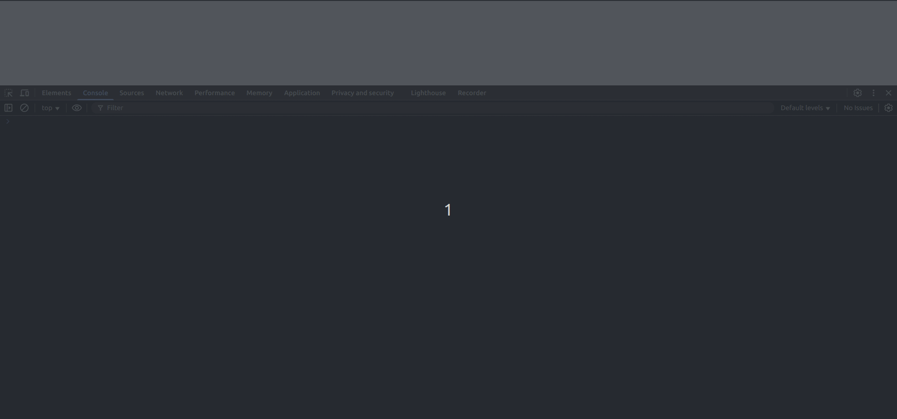

# RPS - Web Dev Edition
Play the classic Rock Paper Scissors game, but in your browser! Available in every flavor of browser
(except maybe IE, that stuff is ancient so who knows what would happen)!

## Usage
Simply clone the project to wherever you like, then launch `index.html` in your preferred browser
(Ungoogled Chromium is used in the demo GIF). Enter a number for however many rounds a player needs
to win, and three RPS buttons will appear.

At this time, starting a new game is done by reloading the tab. Future updates may implement a
button or something to achieve this without reloading.