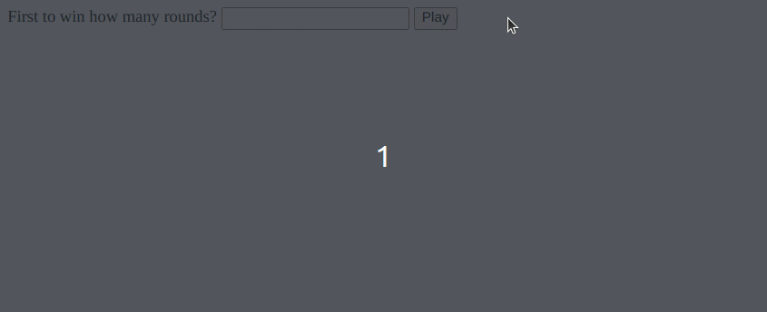

# RPS - Web Dev Edition
Play the classic Rock Paper Scissors game, but in your browser console! Available in every flavor of browser (except maybe IE, that stuff is ancient so who knows what would happen)!

## Usage
Simply clone the project to wherever you like, then launch `index.html` in your preferred browser (Ungoogled Chromium is used in the demo GIF). Run using `playGame(rounds)` in the browser console, where `rounds` is the number rounds you'd like to play against the computer. Note that it is not "first to **X** wins" as traditionally played, but "whoever wins the most".